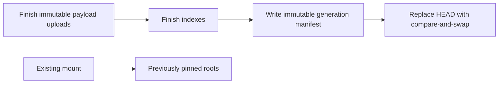

# Object-store layout

An ordinary `gat import` chooses archive format **8** for a qualified complete
single-pack SHA-1 repository. Other sources use reachable-object conversion and
write format **6**. Readers also accept formats 4, 5, 7 and retained development
publications, including 9015. There is no special build or importer environment
switch. See [import selection](README.md#import-modes-and-compression) and the
[repeatable verification harness](scripts/VERIFY_LINUX.md).

```text
bucket/repository-prefix/
├── HEAD                         current protobuf manifest; only mutable object
├── generations/
│   └── <manifest-sha256>         immutable copy of the published manifest
├── index/
│   ├── <index-build-id>/         main, refs, and history index pages
│   ├── blobs-<build-id>/         direct blob index pages (format 8)
│   ├── global-sizes-<id>         bounded blob-size table (format 8)
│   ├── tree-archive-<id>/        native tree read recipes (format 8)
│   └── dirs-<import-id>/         compressed directory pages for converted trees
└── packs/
    ├── archive-<import-id>/      unchanged source-pack bytes in 64 MiB segments
    │   ├── 00000000
    │   └── 00000001
    └── <import-id>/              converted payloads, at most 64 MiB per pack
        ├── 00000000
        └── 00000001
```

Manifests, page records, and read recipes use protobuf schemas under
[`proto/`](proto), generated with Buf. Native archive bytes retain Git's zlib
encoding. Converted file chunks and directory pages use Zstandard. The global
size table is a compact bounded binary lookup table described by an authenticated
protobuf catalog record.

`HEAD` contains the manifest directly: format version, Git hash format, main
catalog root, refs root/digest, captured source tips, history root/count, and,
for archive stores, the direct blob root. Opening a mount does not require a
second GET from `generations/`.

Here, `HEAD` identifies the latest published **catalog generation**, which may
contain many commits. It does not choose a branch or mounted commit. Each mount
selects its own commit and pins immutable catalog roots independently.

## Catalogs and indexes

The main catalog is an immutable B-tree. Each page holds at most 128 records or
child pointers. Internal pages route using upper key bounds; leaves contain
sorted keys and protobuf values. A page reference records its pack key, byte
offset, length, and SHA-256 checksum. Pages are batched in immutable packs up to
8 MiB. Readers fetch individual page ranges and verify their checksums; they
never need to LIST the object store or download a complete catalog.

| Logical main-index key | Value |
| --- | --- |
| `c/<commit-id>` | Bounded author, committer, timestamp, and message fields, with explicit truncation flags |
| `p/<commit-id>` | Ordered parent IDs; empty for roots |
| `o/<commit-id>` | Object type, original size, and root tree ID |
| `o/<blob-id>` | Object type and original file size |
| `o/<tree-id>` | Original size and a native recipe or compiled directory root |
| `x/global-sizes` | Authenticated location of the global blob-size table in format 8 |
| `t/<tree-id>/<hex-filename>` | Legacy format-4/5 directory entry |
| `b/<blob-id>/<hex-part>` | Format-6 chunk location and embedded dependencies |
| `a5/<path-and-part-hint>` | Writer-only bounded delta candidates for conversion imports |
| `a/<path-and-part-hint>` | Older full-base candidate hint |

These are **keys inside pages**, not individual object-store objects. Arbitrary
filename bytes are preserved by protobuf byte fields or legacy hex filename
keys. Git object identities remain SHA-1 or SHA-256; archive mode currently
requires SHA-1.

Format 8 stores blob parts in a separate direct B-tree keyed by binary object ID
and part number. A leaf combines original blob size and its read recipe or chunk
location. This avoids a second main-catalog lookup for each part. Pages have a
64 KiB wire cap and at most 128 items or child references.

The refs index stores full names, original ref object IDs, peeled target IDs, and
symbolic targets. Targets may be commits, trees, or blobs; only commits are valid
mount targets. Annotated-tag aliases support peeling. An import captures all
refs and replaces this small index so deleted refs disappear atomically.

The history index maps commit IDs to topological positions and stores blocks of
up to 256 commits. Blocks contain ordered parent positions, tree IDs, and a
512-bit first-parent changed-path Bloom filter. A negative result skips an
unchanged path; a positive result triggers an exact tree comparison. False
positives affect speed, not attribution. This index stores no file bodies or
precomputed blame output. Archive catalogs include all source-local commits,
trees, and blobs; history blocks cover commits reachable from captured refs.

## Native archive reads

Archive import copies one source pack into immutable 64 MiB segments and records
bounded recipes that point at its existing zlib frames. A recipe embeds the
complete base-to-target dependency sequence, frame ranges, sizes, and object IDs.
Reading a file does not discover bases by walking commit history or downloading
the source pack.


Native blob recipes admit nonempty targets up to 1 MiB; native tree targets are
limited to 64 KiB. A recipe is at most 8 KiB and contains at most 64 frames.
Its cold read plan permits at most 3 MiB of fetched compressed bytes and 4 MiB
of decoded/reconstructed work. Blob admission permits at most four ranges;
trees permit up to sixteen. At most four range GETs execute concurrently per
recipe. Each intermediate reconstructed object is verified against its Git
identity before reuse. Cached verified bases can shorten the reconstruction.

Import does not reconstruct or authenticate every accepted archive payload. It
parses bounded pack metadata and applies admission limits, then leaves content
authentication to readers. The default cgo build uses native zlib for these
operations; `CGO_ENABLED=0` provides a pure-Go build. Missing `.rev` reverse
indexes are synthesized in owned temporary staging, without modifying the source.
Unsupported source shapes select format-6 conversion with a reported reason;
malformed source data and I/O errors do not silently become successful imports.

Objects exceeding native admission limits use conversion. Large blobs retain
1 MiB chunk addressing; tree fallbacks use compressed directory pages. The
archived source pack is still copied once, so its bytes and converted fallbacks
both contribute to stored size. This is why total store size is larger than
that of the original Git pack even when most native deltas are retained.

## Directories and cache bounds

Opening a format-8 snapshot loads its global size table and the required catalog
pages. The table supplies sizes for native tree entries without a per-file
catalog lookup. Root `ls` loads only root tree ranges or directory pages;
entering a child loads that child's directory on demand. Listing a directory
does not fetch its files' contents or recursively load descendants. A native
tree and a blob can occupy different byte ranges within the same archive segment.

Converted directory pages contain names, binary object IDs, modes, and sizes.
Each page is independently Zstandard-compressed, holds at most 128 entries or
child pointers, and has a 64 KiB decoded cap. Lookup follows the routing path
for one name; listing returns bounded batches. Identical pages can share an
immutable range within an import. Older format-4/5 directory records remain
readable without rewriting their trees.

Format-8 stores require a configured cache of at least **32 MiB**. The repository
reserves 16 MiB for one global size table, including owned lookup metadata, and
uses a shared 16 MiB LRU for retained pages and decoded data. Snapshots and command
views share that owner. When generations change, the single table slot is
replaced; an old snapshot can reload its own immutable table later. A larger
configured cache does not currently enlarge these format-8 allocations.

Format-6 and older conversion stores use the configured LRU size and support
zero retention. In both layouts, cache accounting is a retained-data bound,
**not an RSS ceiling**. Query buffers, bounded in-flight decoding, cache
bookkeeping, FUSE inodes/handles, and the Go runtime use additional memory. Readers
never create a checkout or a persistent data cache on disk.

## Converted chunk reads

Conversion splits a file into 1 MiB uncompressed chunks. A chunk is a full
Zstandard frame or a Zstandard-compressed protobuf copy/literal delta. Every base
reference embeds its own dependency range, ending at a full frame. Delta depth
defaults to one and can be set to 1–8; a cold read needs at most depth + 1 payload
GETs. Missing ranges can be fetched concurrently. Readers verify reconstructed
checksums; bases and results share the bounded cache.

The importer uses bounded matching by path/chunk hint, compares actual compressed
sizes, and accepts a delta only when it saves at least 20% after a 200-byte
allowance per dependency. Writer anchor records allow incremental reuse. These
are hints, not file identities. Explicit delta settings or `--no-deltas` select
this conversion mode. All referenced bases must remain available while a mounted
or published generation can use them.

## Publication and version switching



Archive updates build a **complete replacement generation**, including copied
pack bytes and new indexes. They currently have no incremental reuse of the
previous archive generation. Conversion imports into formats 4–6 can reuse old
payloads and index subtrees, append history blocks, and publish only changed
paths. Moving from an archive publication to conversion also rebuilds a complete
generation. No mode overwrites existing immutable objects.

Both modes publish with the exact `HEAD` token captured before staging. Initial
publication is create-only. Two writers starting with the same token cannot
both succeed; the loser gets a conflict and must restart. Missing tokens fail
closed. S3 uses native conditional PUT; local storage uses a stable per-key lock,
fsync, and atomic rename. Uploaded objects from losing writers remain harmless
and unreferenced. A transport failure during publication can have an ambiguous
outcome. Garbage collection is not implemented: keep old packs, indexes, and
generations while readers may use them.

A mount switches by resolving the requested commit and atomically replacing its
snapshot pointer. It does not materialize files or walk a whole checkout. Inodes
are derived from paths, so a file at the same path keeps its inode across content
changes. Already-open file handles retain their original data snapshot; new
opens and path attributes reflect the selected version. Other mounts stay pinned.

The format preserves checkout and view data, not a byte-for-byte export of every
original Git object. Commit metadata retains up to 24 KiB of message and 4 KiB
of each identity field, with explicit truncation flags. Original signed commit
and tag bodies are not exposed by object-view commands.

Implementation: [store interface](internal/store/store.go),
[selection](internal/repo/import_selection.go),
[archive recipes](internal/archive/wire/wire.go),
[direct blob index](internal/repo/direct_blob.go),
[global size table](internal/repo/global_size_reader.go),
[index pages](internal/repo/index.go), and
[publication](internal/repo/import.go).
